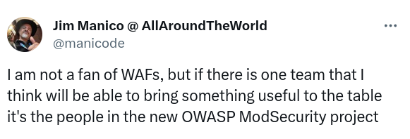
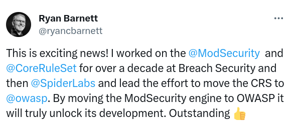
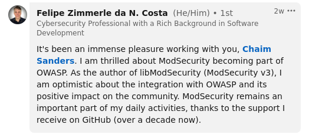
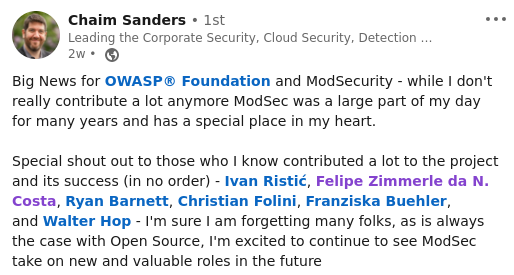

## Endorsements of the New OWASP ModSecurity Project

### Jim Manico, Author, Speaker, Advocate

### Ryan Barnett, Former ModSecurity Leader

### Felipe 'Zimmerle' Costa, Former ModSecurity Head Developer

### Chaim Sanders, Former Leader of OWASP ModSecurity Core Rule Set

