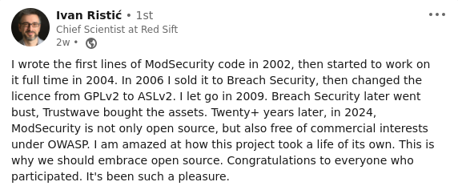

## Endorsements of the New OWASP ModSecurity Project

The fresh start for ModSecurity with a new team and under the roof of the OWASP foundation was welcomed by many, many important people in the security community.

Here are a few statements that endorse the new project and the plans.

### Jim Manico, Author, Speaker, Advocate

### Ivan Ristić, Original Author of ModSecurity

### Ryan Barnett, Former ModSecurity Leader

### Felipe 'Zimmerle' Costa, Former ModSecurity Head Developer

### Chaim Sanders, Former Leader of OWASP ModSecurity Core Rule Set

